# Diagrama de Entidad-Relación del Sistema

```mermaid
erDiagram
    %% SECURITY MODULE
    User ||--o{ Order : "places"
    User {
        int id PK
        string username
        string email
        string password
        string phone
        string avatar
    }
    
    Role ||--|{ RoleResource : "has"
    Role ||--o| Group : "links_to"
    Role {
        int id PK
        string name
        int group_id FK
        string description
    }
    
    Resource ||--o{ Subresource : "contains"
    Resource ||--o{ RoleResource : "assigned_to"
    Resource {
        int id PK
        string name
        string description
        int order
        string icon
    }
    
    Subresource ||--o{ RoleResource : "granted"
    Subresource {
        int id PK
        int resource_id FK
        string name
        string url
        int order
    }
    
    RoleResource {
        int id PK
        int role_id FK
        int resource_id FK
        int subresource_id FK
    }
    
    %% CATALOG MODULE
    Product ||--o{ ProductVariant : "has"
    Product ||--o{ ProductImage : "has"
    Product ||--o{ ProductCategory : "belongs_to"
    Product {
        int id PK
        string sku UK
        string name
        text description
        decimal base_price
        string brand
        string status
        datetime created_at
        datetime updated_at
    }
    
    Category ||--o{ ProductCategory : "contains"
    Category ||--o{ Category : "parent_of"
    Category {
        int id PK
        string name
        int parent_id FK
        string status
        datetime created_at
    }
    
    ProductCategory {
        int id PK
        int product_id FK
        int category_id FK
    }
    
    ProductVariant ||--o{ VariantAttributeValue : "has"
    ProductVariant ||--o{ Inventory : "tracked_in"
    ProductVariant ||--o{ CartItem : "added_to"
    ProductVariant ||--o{ OrderItem : "ordered_as"
    ProductVariant {
        int id PK
        int product_id FK
        string code UK
        decimal price
        string status
        datetime created_at
    }
    
    Attribute ||--o{ AttributeValue : "has"
    Attribute ||--o{ VariantAttributeValue : "defines"
    Attribute {
        int id PK
        string name UK
    }
    
    AttributeValue ||--o{ VariantAttributeValue : "assigned"
    AttributeValue {
        int id PK
        int attribute_id FK
        string value
    }
    
    VariantAttributeValue {
        int id PK
        int variant_id FK
        int attribute_id FK
        int attribute_value_id FK
    }
    
    ProductImage {
        int id PK
        int product_id FK
        string url
        string alt
        boolean is_main
        int sort
        datetime created_at
    }
    
    %% INVENTORY MODULE
    Warehouse ||--o{ Inventory : "stores"
    Warehouse {
        int id PK
        string name
        string location
        string code UK
        boolean is_active
        datetime created_at
    }
    
    Inventory {
        int id PK
        int variant_id FK
        int warehouse_id FK
        int stock_on_hand
        int stock_reserved
        int min_stock
        datetime updated_at
    }
    
    %% SALES MODULE
    Customer ||--o{ Address : "has"
    Customer ||--|| Cart : "has"
    Customer ||--o{ Order : "places"
    Customer {
        int id PK
        string full_name
        string email
        string phone
        string ci_nit
        boolean is_active
        datetime created_at
    }
    
    Address {
        int id PK
        int customer_id FK
        string line1
        string city
        string state
        string zip
        string notes
        boolean is_default
    }
    
    Cart ||--o{ CartItem : "contains"
    Cart {
        int id PK
        int customer_id FK
        datetime created_at
        datetime updated_at
    }
    
    CartItem {
        int id PK
        int cart_id FK
        int variant_id FK
        int qty
        decimal unit_price
        datetime added_at
    }
    
    Order ||--o{ OrderItem : "contains"
    Order ||--|| Payment : "paid_with"
    Order ||--o| Address : "ships_to"
    Order {
        int id PK
        int customer_id FK
        string order_number UK
        string currency
        string status
        decimal subtotal
        decimal discount_total
        decimal shipping_total
        decimal total
        string payment_status
        int shipping_address_id FK
        datetime created_at
        datetime updated_at
    }
    
    OrderItem {
        int id PK
        int order_id FK
        int variant_id FK
        int qty
        decimal unit_price
        decimal discount
    }
    
    Payment {
        int id PK
        int order_id FK
        string provider
        string provider_ref
        string status
        decimal amount
        datetime paid_at
        datetime created_at
    }
    
    %% ANALYTICS MODULE
    SaleFact {
        int id PK
        date date
        int product_id
        string product_name
        int category_id
        string category_name
        int variant_id
        string variant_code
        int customer_id
        string customer_name
        int qty
        decimal revenue
        decimal cost
        decimal discount
        int order_id
        datetime created_at
    }
    
    ForecastModel {
        int id PK
        string name
        text description
        string model_type
        string file_path
        float mae
        float rmse
        float r2_score
        date training_date_from
        date training_date_to
        text features_used
        boolean is_active
        datetime created_at
    }
    
    Report {
        int id PK
        string report_type
        string title
        text description
        string format
        text filters
        string generated_by
        string file_path
        int file_size
        datetime created_at
    }
```

## Índices Principales

### Security
- `User.username` (unique)
- `Role.name` (unique)
- `Resource.name` (unique)
- `RoleResource(role, resource, subresource)` (unique together)

### Catalog
- `Product.sku` (unique)
- `Product.status`
- `ProductVariant.code` (unique)
- `ProductVariant(product, status)`
- `ProductImage(product, sort)`
- `AttributeValue(attribute, value)` (unique together)
- `VariantAttributeValue(variant, attribute)` (unique together)

### Inventory
- `Warehouse.code` (unique)
- `Inventory(variant, warehouse)` (unique together)

### Sales
- `Order.order_number` (unique)
- `Order(customer, status)`
- `Order.created_at`
- `CartItem(cart, variant)` (unique together)

### Analytics
- `SaleFact.date`
- `SaleFact(product_id, date)`
- `SaleFact(category_id, date)`
- `SaleFact(customer_id, date)`
- `SaleFact(date, product_id, variant_id)`
